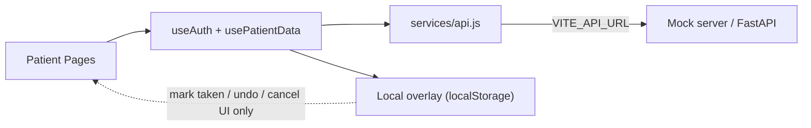
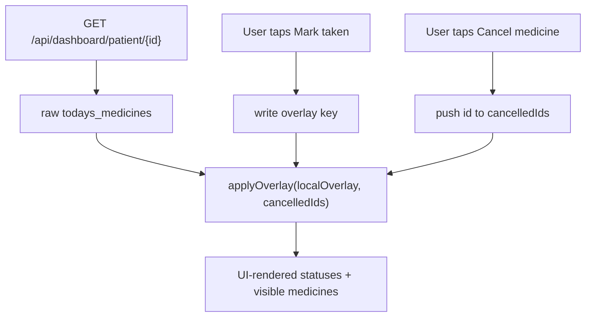

## Goal

Make the patient frontend integration-ready against [docs/API_CONTRACT.md](docs/API_CONTRACT.md). After this plan, switching `VITE_API_URL` between the mock server (`localhost:8001`) and the real backend should be the only configuration change needed.

## Architecture (target)

Three rules:
- All real data flows through `services/api.js` with JWT in `Authorization` header.
- Local overlay is purely cosmetic; it never replaces server data, only annotates it.
- Auth uses backend `/api/auth/*`; only the JWT and a minimal session user are cached client-side.

## Key files and what changes

### 1. Auth + token plumbing
- [frontend/src/utils/auth.js](frontend/src/utils/auth.js) - replace localStorage user store with API calls. New shape:
  - `registerUser(form)` -> `POST /api/auth/register`
  - `login(email, password)` -> `POST /api/auth/login`, stores `auth_token` (the contract key already used by `api.js`) and `medicomates_user` (id, full_name, role)
  - `logout()` clears both keys
  - `getAuthToken()`, `getCurrentUser()` accessors
- [frontend/src/hooks/useAuth.js](frontend/src/hooks/useAuth.js) - make `login`/`register` actually `await` the API utils, route by `role` returned from server, surface API error messages.

### 2. API service hardening
- [frontend/src/services/api.js](frontend/src/services/api.js) - add non-2xx error handling so hooks can `setError` cleanly. Add a small `endpoints` object so call sites read like `endpoints.dashboard.patient(id)` (keeps URL strings in one file).

### 3. Route guard with role check
- [frontend/src/App.jsx](frontend/src/App.jsx) - extend `ProtectedRoute` to read both `auth_token` and `medicomates_user.role`, accept a `requiredRole` prop, and redirect to the correct dashboard on mismatch. Patient routes get `requiredRole="patient"`, doctor routes `requiredRole="doctor"`.
- [frontend/src/pages/Splash.jsx](frontend/src/pages/Splash.jsx) - if `auth_token` exists, redirect to the role-based dashboard automatically.

### 4. Patient dashboard data layer (the biggest change)
- [frontend/src/hooks/usePatientData.js](frontend/src/hooks/usePatientData.js) - rewrite to fetch in parallel:
  - `GET /api/dashboard/patient/{patient_id}` -> `dashboard` (profile, todays_medicines, streak, weekly_percentage, last_week_percentage)
  - `GET /api/connections/doctors/{patient_id}` -> `doctors`
  - `GET /api/visits/{patient_id}` -> `visits`
  - `GET /api/adherence/{patient_id}?days=30` -> `adherenceLogs`
- Apply two thin local overlays (kept in localStorage) on top of the API response:
  - `medicomates_dose_overlay`: marks a specific `{medicine_id, date, time}` as `taken` for the UI only
  - `medicomates_cancelled_medicines`: hides medicines the patient "cancelled" from today's schedule
- Expose the same surface the dashboard already consumes: `markDoseTaken`, `markDoseUntaken`, `cancelMedicine`, `refresh`. They mutate localStorage overlays and re-render; they do not call the backend (per chosen scope).
- Remove the previous local computation of `weekly_percentage`; trust the server value from `/api/dashboard/patient/{id}`.

### 5. Patient dashboard UI alignment
- [frontend/src/pages/PatientDashboard.jsx](frontend/src/pages/PatientDashboard.jsx) - no major UI rewrite; just consume the new shape:
  - Render `dashboard.streak.current` and `dashboard.last_week_percentage` (currently unused).
  - Doctors and visits are now real arrays from API instead of empty.
  - Keep `MedicineCard`/`AdherenceCalendar` props identical so those components don't change.

### 6. MedicineForm: real CRUD + OCR
- [frontend/src/pages/MedicineForm.jsx](frontend/src/pages/MedicineForm.jsx):
  - Replace localStorage save with:
    - Create -> `POST /api/medicines` with the contract body shape (`patient_id`, `name`, `dosage`, `frequency`, `reminder_times`, `start_date`, `end_date`, `notes`).
    - Edit -> `PUT /api/medicines/{id}`.
  - Add a "Upload prescription" file input that calls `POST /api/ocr` (multipart) and prefills the form from the first item of the response array. Per [docs/CORE.md](docs/CORE.md) this is USP #4 and is currently missing on the patient side.
  - On success, navigate back to `/patient` (current behaviour preserved).

### 7. Notes page (patient mode) - real data
- [frontend/src/pages/Notes.jsx](frontend/src/pages/Notes.jsx):
  - Doctor list comes from `GET /api/connections/doctors/{patient_id}` (not all users with role=doctor).
  - Load thread via `GET /api/notes/{patient_id}/{doctor_id}`.
  - On mount, mark read via `PUT /api/notes/read/{patient_id}/{doctor_id}`.
  - Send via `POST /api/notes` with `{ patient_id, doctor_id, message }`.
  - Drop all `localStorage` reads/writes.

### 8. Confirm-taken polish
- [frontend/src/pages/ConfirmTaken.jsx](frontend/src/pages/ConfirmTaken.jsx) - stop printing the raw `medicine` query param (it is a UUID per [docs/CORE.md](docs/CORE.md) line 343). Show a generic friendly success message instead. Keep the page strictly public; no API calls.

### 9. Env + docs
- Confirm/create `frontend/.env.example` with:
  - `VITE_API_URL=http://localhost:8001` (mock default per [docs/PROJECT_CONTEXT.md](docs/PROJECT_CONTEXT.md))
- README note: switching to real backend is one env var.

## Local overlay contract (chosen scope)

User chose to keep "Mark taken / Undo / Cancel medicine" as local-only UI helpers.

Trade-off explicitly accepted: cancel medicine does not call `DELETE /api/medicines/{id}` even though the endpoint exists. If you change your mind, swap the overlay write for a real DELETE in one place inside `usePatientData.cancelMedicine`.

## Out of scope for this plan
- Doctor side ([frontend/src/pages/DoctorDashboard.jsx](frontend/src/pages/DoctorDashboard.jsx) and [frontend/src/pages/PatientProfile.jsx](frontend/src/pages/PatientProfile.jsx)) - they also use localStorage but they are owned by Frontend 2 per [docs/TEAM.md](docs/TEAM.md). Flag them for that owner; don't touch in this PR.
- Reviewer flow - not built yet on either side.
- Any backend changes - none required for this migration.

## Manual test checklist (after implementation)
1. Start mock server: `uvicorn mock_server:app --reload --port 8001` from `mock_api/`.
2. `VITE_API_URL=http://localhost:8001 npm run dev` in `frontend/`.
3. Register patient -> auto land on `/login`, log in -> `/patient` loads with mock data (Ramesh Kumar, Metformin, weekly 89%, streak 12).
4. Add a medicine via form -> dashboard re-fetches and shows it (mock returns same dataset, but POST should 200).
5. Upload any image to OCR field -> form prefills with Metformin sample after ~1s.
6. Mark a dose taken -> chip flips green, persists across reload (overlay).
7. Open `/notes` -> doctors list comes from API; thread loads.
8. Visit `/confirm?status=success` and `/confirm?status=invalid` -> friendly messages, no UUID leak.
9. Log in as doctor account -> patient routes redirect to `/doctor` (role guard).