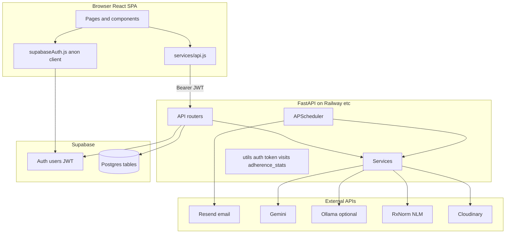

# MedAdhere (Medicomates) — AI / team codebase compendium

**Purpose:** One document to paste into an AI context window (or share with engineers) so they understand **product intent**, **architecture**, **data model**, **auth/RBAC**, **every major code path**, **pitfalls we hit**, **why decisions were made**, and **how queries were optimized**—without reading the whole tree first.

**Audience:** Coding agents, new teammates, future you. **Authority:** This file describes the repository as of the last substantive edit; always verify against `docs/CORE.md`, `docs/API_CONTRACT.md`, and source if behavior diverges.

**Companion files:** `docs/PROJECT_CONTEXT.md` (pitch + philosophy), `docs/CORE.md` (schema + build contract), `docs/API_CONTRACT.md` (HTTP shapes), `docs/EXTRAS.md` / `docs/ENHANCEMENTS.md` (roadmap), `docs/sql/recommended_indexes.sql` (DB performance), `README.md` (quick start).

---

## Table of contents

1. [How to use this document](#1-how-to-use-this-document)
2. [Product summary](#2-product-summary)
3. [Architecture overview](#3-architecture-overview)
4. [Repository map](#4-repository-map)
5. [Technology stack](#5-technology-stack)
6. [Data model (Postgres / Supabase)](#6-data-model-postgres--supabase)
7. [Authentication and sessions](#7-authentication-and-sessions)
8. [Authorization (RBAC)](#8-authorization-rbac)
9. [Backend layout and responsibilities](#9-backend-layout-and-responsibilities)
10. [HTTP API catalog](#10-http-api-catalog)
11. [Critical flows (step-by-step)](#11-critical-flows-step-by-step)
12. [Scheduler, email, and adherence tokens](#12-scheduler-email-and-adherence-tokens)
13. [Adherence statistics (pure domain logic)](#13-adherence-statistics-pure-domain-logic)
14. [Medicines, RxNorm, allergies, interactions](#14-medicines-rxnorm-allergies-interactions)
15. [OCR and Gemini](#15-ocr-and-gemini)
16. [Medical documents and Cloudinary](#16-medical-documents-and-cloudinary)
17. [AI insight card](#17-ai-insight-card)
18. [Connections and reviewers](#18-connections-and-reviewers)
19. [Frontend layout](#19-frontend-layout)
20. [Client ↔ server contract](#20-client--server-contract)
21. [Supabase / PostgREST usage and performance](#21-supabase--postgrest-usage-and-performance)
22. [Testing](#22-testing)
23. [Configuration and deployment](#23-configuration-and-deployment)
24. [Encyclopedia of pitfalls and resolutions](#24-encyclopedia-of-pitfalls-and-resolutions)
25. [Technical debt and extensions](#25-technical-debt-and-extensions)
26. [Quick file index](#26-quick-file-index)
27. [Glossary](#27-glossary)

---

## 1. How to use this document

- **If you need to implement a feature:** Find the closest flow in §11, then the API row in §10, then the backend module in §9.
- **If you need to debug auth:** Read §7–8 before changing anything; most “bugs” are token expiry or missing `profiles` rows.
- **If you need DB performance:** Read §21 and apply `docs/sql/recommended_indexes.sql` in Supabase after validating on a copy.
- **If you are an AI agent:** Treat `docs/CORE.md` schema as canonical for SQL column names; this file explains **runtime wiring** around that schema.

---

## 2. Product summary

**MedAdhere** is a **three-sided** medication adherence web application:

| Actor | Needs | Product answer |
|-------|--------|----------------|
| Patient (often elderly) | Low friction to confirm doses | HTML email with **one link**; confirmation **does not use app login** |
| Doctor | Visibility between visits | Dashboard with rolling adherence, full patient profile, notes, visit timeline, **AI summary** of 30-day patterns |
| Family / caregiver | Peace of mind without editing clinical data | Same app as patient; **reviewer** link is a **row in `patient_reviewer_connections`**, not a new account type |

**Design principles (why judges / users care):**

1. **Alignment over reminders** — The hard problem is *verification and shared truth*, not another alarm clock.
2. **AI speaks to the clinician** — Gemini summarizes **structured** adherence text built in Python; we avoid patient-facing chatbot positioning.
3. **Warnings, not hard blocks** — Allergy / interaction checks surface as **modal warnings** with a confirm save path (clinical realism).

---

## 3. Architecture overview

### 3.1 Logical diagram



### 3.2 Trust boundaries

- **Browser holds JWT** in `localStorage` (see `frontend/src/utils/auth.js`). Anyone with XSS can exfiltrate it—standard SPA tradeoff.
- **Backend holds service role key** (`SUPABASE_SERVICE_KEY`). It **bypasses Row Level Security (RLS)**. All authorization for patient data must stay in **FastAPI** (we use explicit checks, not RLS, today).
- **Email confirmation token** is a **capability URL**; it is the only secret for that action. Must be high entropy, HTTPS in production, and invalidated or marked used after success.

---

## 4. Repository map

```
Medicomates/
├── README.md
├── docs/                    # Human product + API reference
│   ├── CORE.md              # Schema + non‑negotiable build
│   ├── API_CONTRACT.md
│   ├── PROJECT_CONTEXT.md
│   ├── TEAM.md, EXTRAS.md, ENHANCEMENTS.md
│   └── sql/
│       └── recommended_indexes.sql
├── logs/                    # Pitch, evaluation, this file
├── backend/
│   ├── main.py              # FastAPI app, CORS, router include, lifespan
│   ├── config.py            # Pydantic Settings → settings singleton
│   ├── scheduler.py         # APScheduler instance + start/stop
│   ├── requirements.txt
│   ├── api/                 # HTTP routers (thin orchestration)
│   ├── services/          # Side effects: email, Gemini, scheduler, RxNorm…
│   ├── models/schemas.py  # Pydantic request/response bodies
│   └── utils/               # auth, token, supabase client, batch helpers, stats
├── frontend/
│   └── src/
│       ├── App.jsx         # Routes + ProtectedRoute
│       ├── pages/          # Screen-level components
│       ├── components/     # Reusable UI + domain widgets
│       ├── hooks/          # useAuth, usePatientData
│       ├── services/api.js
│       └── utils/
└── mock_api/               # Optional dev mock server
```

---

## 5. Technology stack

| Layer | Tech | Role |
|-------|------|------|
| UI | React 18 + Vite | SPA |
| Styling | Tailwind CSS | Utility-first UI |
| Motion | Framer Motion | Dashboard polish |
| API | FastAPI (Python 3.11) | REST + dependency injection |
| DB + Auth | Supabase | Postgres + GoTrue JWT auth |
| DB access | supabase-py | PostgREST from backend |
| Jobs | APScheduler | Cron per medicine slot |
| Mail | Resend | Transactional HTML email |
| LLM | Gemini 2.5 Flash (+ Ollama optional) | OCR + insight text |
| Drugs | RxNorm (NLM) | rxcui + interactions |
| Files | Cloudinary | Binary storage; DB stores metadata |

---

## 6. Data model (Postgres / Supabase)

Canonical column lists live in `docs/CORE.md`. Mentally group tables:

| Table | Role |
|-------|------|
| `auth.users` | Supabase-managed identities (not queried directly from frontend for emails in most cases) |
| `profiles` | App user: `id` = auth user id, `role` ∈ {patient, doctor}, demographics, `allergies` text |
| `medicines` | Prescription rows per patient; `reminder_times` text[]; supply columns; `rxcui`; `is_active` |
| `adherence_logs` | One row per scheduled dose instance: `scheduled_time`, `confirmed_at`, `token`, `token_used` |
| `patient_doctor_connections` | Many-to-many active care links |
| `patient_reviewer_connections` | Reviewer read access |
| `connection_requests` | Pending doctor/reviewer requests before accept |
| `notes` | Patient ↔ doctor message thread |
| `visits` | Append-only timeline summaries (auto-inserted on clinical actions) |
| `medical_documents` | Metadata + Cloudinary URLs |

**Why `profiles` mirrors auth id:** Single UUID across Auth and app tables simplifies joins and JWT `sub` checks.

---

## 7. Authentication and sessions

**Registration** (`POST /api/auth/register` in `backend/api/auth.py`):

1. `supabase.auth.sign_up` creates Auth user.
2. Immediately `profiles.upsert` with `id`, `role`, `full_name`.
3. If upsert fails silently in the wild, `get_current_user` later returns 403 “no profile”—watch logs.

**Login** (`POST /api/auth/login`):

1. `sign_in_with_password` → `session.access_token` + user.
2. Load `profiles` row for role and display name.
3. Frontend stores token (`auth_token`) and user JSON.

**Per-request auth** (`utils/auth.py` → `get_current_user`):

1. `HTTPBearer` extracts raw JWT.
2. `supabase.auth.get_user(token)` validates signature/expiry via Supabase.
3. `profiles.select("id, role, full_name").eq("id", user.id).single()`.

**Why HTTPBearer:** Swagger “Authorize” works; malformed `Authorization` headers fail fast.

**Frontend password reset:** `ForgotPassword.jsx` uses **anon** Supabase client (`frontend/src/utils/supabaseAuth.js`)—Supabase sends the reset email; backend is not in that path.

---

## 8. Authorization (RBAC)

Pattern: **every route that touches another user’s clinical data** should:

1. Resolve `current_user` via `Depends(get_current_user)`.
2. Compare `current_user["id"]` and `current_user["role"]` to the resource’s `patient_id` / connection tables.
3. For medicines, centralized helpers in `medicines.py` assert read vs write (patient owner, connected doctor, reviewer read-only).

**Reviewer:** Not `role === "reviewer"`**.** A reviewer is a **patient account** with a row in `patient_reviewer_connections` granting read paths (e.g. `GET /api/dashboard/reviewer/{patient_id}` checks that table before returning data).

---

## 9. Backend layout and responsibilities

### 9.1 `main.py`

- Instantiates `FastAPI` with `lifespan`: **start scheduler**, **`reschedule_all_active_medicines()`**, yield, **shutdown scheduler**.
- CORS: `settings.FRONTEND_URL` + `http://localhost:5173`.
- Routers under `/api` prefix (each router file adds its own sub-prefix like `/auth`, `/medicines`).

### 9.2 `config.py`

- `pydantic-settings` loads `backend/.env`.
- Required strings validated/stripped (quotes stripped to avoid copy-paste mistakes).

### 9.3 API routers (`backend/api/`)

| File | Concern |
|------|---------|
| `auth.py` | register, login, `/me` |
| `medicines.py` | CRUD + allergy pipeline + confirm-after-warnings |
| `adherence.py` | Public `GET /confirm` redirect; `POST /mark`; log listing + summary |
| `dashboard.py` | Patient dashboard aggregate, doctor list aggregate, reviewer aggregate + 30d calendar rows, insight proxy |
| `connections.py` | Search, requests, accept/reject, list doctors/patients/reviewers, **batched** doctor-patient list with weekly % |
| `notes.py` | Thread fetch/create, mark read |
| `visits.py` | List visits for patient |
| `documents.py` | Cloudinary-backed uploads with RBAC |
| `ocr.py` | Multimodal prescription intake |
| `testing.py` | Dev/demo helpers (guard in prod if needed) |

### 9.4 Services (`backend/services/`)

Side-effecting or third-party modules: **email**, **Gemini**, **insight orchestration**, **scheduler glue**, **RxNorm**, **allergy logic**, **document pipeline**, **Cloudinary adapter**.

### 9.5 Utils (`backend/utils/`)

| File | Role |
|------|------|
| `supabase_client.py` | Singleton `create_client(url, service_key)` |
| `supabase_batch.py` | `chunked_ids()`, `ADHERENCE_WINDOW_COLUMNS` for batched IN queries |
| `auth.py` | JWT → profile dict |
| `token.py` | Generate/validate adherence tokens for email links |
| `visits.py` | `log_visit` helpers called from mutations |
| `adherence_stats.py` | `compute_status`, streaks, window % (pure functions) |

---

## 10. HTTP API catalog

Prefix: `/api` + router prefix. Auth: `Authorization: Bearer <access_token>` unless noted.

| Method | Path | Notes |
|--------|------|------|
| GET | `/health` | No auth |
| POST | `/api/auth/register` | Body: email, password, role, full_name |
| POST | `/api/auth/login` | Returns access_token + profile fields |
| GET | `/api/auth/me` | Validates token |
| GET | `/api/adherence/confirm?token=` | **Public** — redirects to frontend |
| POST | `/api/adherence/mark` | Patient-only manual toggle |
| GET | `/api/adherence/{patient_id}` | Logs + `medicine_name` enrichment |
| GET | `/api/adherence/{patient_id}/summary` | Aggregated % per medicine/slot |
| GET | `/api/dashboard/patient/{id}` | Today’s card data + streak + weekly % |
| GET | `/api/dashboard/doctor/{id}` | **Batched** patient cards |
| GET | `/api/dashboard/reviewer/{id}` | Same as patient + `adherence_logs` 30d |
| GET | `/api/dashboard/insight/{id}` | Async Gemini/Ollama insight |
| … | `/api/medicines/*` | See `API_CONTRACT.md` |
| … | `/api/connections/*` | Search, requests, lists |
| … | `/api/notes/*`, `/api/visits/*`, `/api/documents/*`, `/api/ocr/*` | Feature modules |

---

## 11. Critical flows (step-by-step)

### 11.1 Patient opens dashboard

1. `ProtectedRoute` ensures JWT + role patient.
2. `usePatientData` fires `Promise.allSettled` against dashboard, medicines, connections, visits, adherence logs, request queues, reviewer lists.
3. Dashboard endpoint returns **aggregated** today view; hook merges **localStorage overlays** for optimistic UX (dose marked taken before network completes).

**Why overlays exist:** Perceived instant feedback on flaky mobile networks; backend remains source of truth after refresh.

### 11.2 Scheduler sends a reminder

1. `schedule_medicine` registers `CronTrigger` per `HH:MM` in `SCHEDULER_TIMEZONE`.
2. Job runs `send_reminder_for_medicine`:
   - Loads medicine row (**narrow select**: id, patient_id, name, dosage, is_active).
   - Fetches patient email via `supabase.auth.admin.get_user_by_id`.
   - Inserts `adherence_logs` with new `token`.
   - Calls `send_reminder_email` (Resend).

### 11.3 Patient clicks email link

1. Browser hits backend `GET /api/adherence/confirm?token=…` (**no JWT**).
2. `validate_token` loads matching log; rejects unknown/used tokens.
3. Updates `confirmed_at`, `token_used`.
4. Redirects to `FRONTEND_URL/confirm?status=success|invalid`.

### 11.4 Doctor opens patient list

1. Frontend `DoctorDashboard` calls `GET /api/dashboard/doctor/{doctorId}`.
2. Backend loads connection rows, then **batches**:
   - `profiles` for all `patient_id`s in chunks of 80 UUIDs.
   - `adherence_logs` for same chunks with `scheduled_time >= now-30d`.
3. Python groups logs per patient and applies **same** `calculate_time_window_percentage` as before refactor.

**Why chunk size 80:** PostgREST builds a query string; huge `in.(uuid,uuid,…)` URLs hit reverse-proxy limits. 80 is conservative.

---

## 12. Scheduler, email, and adherence tokens

- **Timezone:** `SCHEDULER_TIMEZONE` (default `Asia/Kolkata`) must match where patients interpret “9 PM”.
- **Boot replay:** `reschedule_all_active_medicines` queries **`id, reminder_times` only** for active medicines—enough to register jobs, less I/O than `*`.
- **Token generation:** `secrets.token_urlsafe` (see `utils/token.py`) — long, URL-safe, unguessable.

---

## 13. Adherence statistics (pure domain logic)

File: `backend/utils/adherence_stats.py`.

- **`compute_status`:** If `confirmed_at` set → `taken`. Else compare `scheduled_time` to now → `missed` or `pending`.
- **`calculate_time_window_percentage`:** Counts logs whose scheduled timestamp falls in `[start, end]` and status ∈ {taken, missed}; pending excluded.
- **`calculate_streak`:** Buckets logs by UTC date (see implementation comments); computes current backward streak of days where all past-due logs that day are taken.

**Dashboard today slots:** Uses **scheduler timezone** to decide “today” and maps logs to `(medicine_id, local HH:MM)` keys to reconcile cron UTC drift vs displayed slot labels.

---

## 14. Medicines, RxNorm, allergies, interactions

- **`rxnorm_service.py`:** HTTP calls with timeouts; failures must not brick saves.
- **`allergy_service.py`:** Ingredient/class heuristics + patient allergy string.
- **`medicines.py`:** Two-step POST pattern: first call may return `status: "warnings"`; UI posts confirm; optional audit trail of acknowledged warnings.

---

## 15. OCR and Gemini

- **`ocr.py` + `gemini_service.py`:** Image → JSON-ish structure for medicine form.
- **Fallbacks:** Short OCR text may route through vision path (see service comments in repo).

---

## 16. Medical documents and Cloudinary

- **`documents.py` + `cloudinary_documents.py`:** Store secure URL + metadata in `medical_documents`; reviewers blocked where specified.

---

## 17. AI insight card

File: `backend/services/insight_service.py`.

1. Query last 30 days of logs with **explicit columns** + `medicines(name, dosage, reminder_times)` embed (not `*`).
2. `build_adherence_summary` produces deterministic lines like `Metformin: 08:00 — 26/30 (87%)`.
3. **Ollama first** (if configured), else Gemini; `_normalize_insight_text` strips bullets and caps sentences.

**Why structured input to the LLM:** Reduces hallucination vs dumping raw JSON logs.

---

## 18. Connections and reviewers

File: `backend/api/connections.py`.

- **Email search:** Secondary `create_client` uses service key + Auth admin listUsers—Postgres alone does not index auth emails for arbitrary search.
- **`get_doctor_patients`:** Uses same **batched profile + batched logs** strategy as dashboard doctor list for weekly adherence (7-day window).

---

## 19. Frontend layout

- **`App.jsx`:** Declares routes; `ProtectedRoute` wraps authed pages; role mismatch redirects to `/doctor` or `/patient`.
- **Key pages:** `PatientDashboard.jsx` (large), `DoctorDashboard.jsx`, `PatientProfile.jsx`, `MedicineForm.jsx`, `ReviewerView.jsx`, `ConfirmTaken.jsx` (public), auth pages, documents pages.
- **Components:** `AdherenceCalendar`, `MedicineCard`, `NoteThread`, `VisitTimeline`, `InsightCard`, layout/branding, `Modal` + `ToastContext`.

---

## 20. Client ↔ server contract

- **Single module:** `frontend/src/services/api.js` exports `api.get/post/...`, `endpoints.*`, and normalizes FastAPI error payloads into `Error` messages.
- **Environment:** `VITE_API_URL` base; `VITE_SUPABASE_*` for auth helpers.

---

## 21. Supabase / PostgREST usage and performance

### 21.1 Principles

- Prefer **explicit `.select("col1, col2")`** over `*` on large tables (`adherence_logs`, `medicines`) to shrink JSON and memory.
- Prefer **batched `.in_("patient_id", chunk)`** over per-row loops for N patients (doctor dashboard, `get_doctor_patients`).
- Add **composite indexes** matching filters (see `docs/sql/recommended_indexes.sql`).

### 21.2 Code locations (post-optimization)

| Area | Change |
|------|--------|
| `api/dashboard.py` | `_DASHBOARD_LOG_COLUMNS`, `_DASHBOARD_MEDICINE_COLUMNS`, doctor list batching via `chunked_ids`, reviewer 30d explicit select |
| `api/adherence.py` | `_ADHERENCE_LOG_LIST_COLUMNS` for list + summary |
| `api/connections.py` | Batched weekly % for `get_doctor_patients` |
| `services/insight_service.py` | Narrow log select + embedded medicine columns |
| `services/scheduler_service.py` | Boot replay uses `id, reminder_times`; reminder job loads `id, patient_id, name, dosage, is_active` |
| `utils/supabase_batch.py` | Shared chunk + column constant |

### 21.3 What we intentionally did not change

- Routes that return **arbitrary columns to admin UIs** where `*` is safer until audited (`documents` list, some `notes` paths)—can be narrowed later field-by-field.
- **RLS** — still a roadmap item; service role bypass means API must stay strict.

### 21.4 Query optimization changelog (validated in testing)

This subsection records **exactly** what was implemented when doctor dashboards and related paths felt slow or chatty with Supabase. The API **response shapes were preserved** (same JSON keys and semantics); only **round-trips**, **payload size**, and **query shape** changed.

#### A. Eliminated N+1 on doctor-facing lists

**Before:** For each connected patient, the backend issued **two** sequential PostgREST calls (`profiles` by id, `adherence_logs` by patient + time window). With *N* patients that was **1 + 2N** HTTP round-trips per doctor home / patient list load.

**After:**

1. Collect all `patient_id`s from `patient_doctor_connections` (doctor dashboard: last **30** days of logs; `GET /api/connections/patients/{doctor_id}`: last **7** days).
2. **Deduplicate** UUIDs (`dict.fromkeys`) so malformed duplicate links do not blow up `in.(…)` filters.
3. For each **chunk** of at most **80** patient IDs (`utils/supabase_batch.chunked_ids` — avoids oversized GET query strings against PostgREST/proxies):
   - one `profiles.select("id, full_name").in_("id", chunk)`
   - one `adherence_logs.select(<minimal columns>).in_("patient_id", chunk).gte("scheduled_time", …)`
4. Merge rows in Python into `name_by_id` and `logs_by_patient`, then run the **same** `calculate_time_window_percentage` as before per patient.

**Files:** `backend/api/dashboard.py` (`get_doctor_dashboard`), `backend/api/connections.py` (`get_doctor_patients`), shared **`backend/utils/supabase_batch.py`** (`ADHERENCE_WINDOW_COLUMNS`, `chunked_ids`).

**Why it felt faster:** Latency is dominated by **sequential network RTT** to Supabase; batching collapses O(N) trips to O(N / 80) bounded batches (typically **3 queries + connections query** for the doctor dashboard instead of dozens).

#### B. Replaced `select("*")` with explicit column lists

Where we only read a few fields, PostgREST now returns **narrower rows** (less JSON parse, less memory, better chance of index-friendly plans):

| Location | Columns (idea) |
|----------|----------------|
| Patient + reviewer dashboard logs | `id, medicine_id, patient_id, scheduled_time, confirmed_at` |
| Patient + reviewer dashboard medicines | `id, name, dosage, reminder_times, quantity_on_hand, units_per_day, low_supply_threshold_days, patient_id` |
| Reviewer 30d calendar embed | same log fields + `medicines(name)` |
| `GET/POST` adherence list + summary | `id, medicine_id, patient_id, scheduled_time, confirmed_at, token, token_used, created_at` |
| Insight service 30d pull | explicit log columns + `medicines(name, dosage, reminder_times)` (no `*`) |
| Scheduler boot replay | `id, reminder_times` for all active medicines |
| Scheduler reminder job | `id, patient_id, name, dosage, is_active` for the one medicine row |

**Why it helped:** `adherence_logs` and `medicines` are the tables that grow fastest; `*` drags unused columns (e.g. tokens) into dashboards that never display them.

#### C. Database indexes (run in Supabase, not in app code)

**File:** `docs/sql/recommended_indexes.sql` — `CREATE INDEX IF NOT EXISTS` on:

- `(patient_id, scheduled_time DESC)` on `adherence_logs`
- partial index on `medicines (patient_id) WHERE is_active`
- `patient_doctor_connections (doctor_id) WHERE is_active`
- `patient_reviewer_connections (reviewer_id, patient_id)`

Apply in the **Supabase SQL editor** on your project when you are ready; safe alongside the Python changes above.

#### D. What we did *not* optimize (on purpose)

- **OCR path** — left as-is (separate latency profile: image upload + model).
- **`documents` / some `notes` paths`** — still use `*` where a full row shape was not audited field-by-field.
- **RLS** — not enabled as a substitute for FastAPI checks; service role bypasses RLS anyway.

---

## 21A. Complete FastAPI route map (concrete paths)

Base URL is your deployment origin; API lives under `/api`. **Public** routes are called out.

| Method | Full path | Auth | Purpose |
|--------|-----------|------|---------|
| GET | `/health` | No | Liveness |
| GET | `/api/auth/me` | Bearer | Echo current user |
| POST | `/api/auth/register` | No | Sign up + profile row |
| POST | `/api/auth/login` | No | JWT session |
| GET | `/api/adherence/confirm` | **Public** | Email token → update log → redirect |
| POST | `/api/adherence/mark` | Bearer (patient) | Manual dose toggle / insert today row |
| GET | `/api/adherence/{patient_id}` | Bearer | List logs (days param) + `medicine_name` |
| GET | `/api/adherence/{patient_id}/summary` | Bearer | Aggregated slot stats |
| GET | `/api/dashboard/patient/{patient_id}` | Bearer | Patient home aggregate |
| GET | `/api/dashboard/doctor/{doctor_id}` | Bearer | Doctor home; **batched** queries |
| GET | `/api/dashboard/insight/{patient_id}` | Bearer | LLM insight text |
| GET | `/api/dashboard/reviewer/{patient_id}` | Bearer | Reviewer mirror + 30d calendar rows |
| POST | `/api/medicines` | Bearer | Create (may return warnings) |
| POST | `/api/medicines/confirm` | Bearer | Persist after warnings acknowledged |
| GET | `/api/medicines/{patient_id}` | Bearer | List medicines for patient |
| PUT | `/api/medicines/{medicine_id}` | Bearer | Update + reschedule |
| DELETE | `/api/medicines/{medicine_id}` | Bearer | Soft deactivate + unschedule |
| GET | `/api/connections/search` | Bearer | Email user lookup |
| POST | `/api/connections/request` | Bearer | Send connection request |
| GET | `/api/connections/requests/incoming` | Bearer | Pending inbound |
| GET | `/api/connections/requests/outgoing` | Bearer | Pending outbound |
| PUT | `/api/connections/requests/{id}/accept` | Bearer | Accept → insert link row |
| PUT | `/api/connections/requests/{id}/reject` | Bearer | Reject |
| GET | `/api/connections/reviewing` | Bearer | Patients I review |
| GET | `/api/connections/patients/{doctor_id}` | Bearer | Doctor’s patients + **batched** weekly % |
| GET | `/api/connections/doctors/{patient_id}` | Bearer | Patient’s doctors |
| GET | `/api/connections/reviewers/{patient_id}` | Bearer | Patient’s reviewers |
| POST | `/api/notes` | Bearer | Create note |
| GET | `/api/notes/{patient_id}/{doctor_id}` | Bearer | Thread |
| PUT | `/api/notes/read/...` | Bearer | Mark read |
| GET | `/api/visits/{patient_id}` | Bearer | Timeline |
| POST | `/api/documents/upload` | Bearer | Multipart upload |
| GET | `/api/documents/me` | Bearer | Own documents |
| GET | `/api/documents/patient/{patient_id}` | Bearer | Doctor on connected patient |
| PATCH/DELETE | `/api/documents/{document_id}` | Bearer | Metadata / delete |
| POST | `/api/ocr` | Bearer | Prescription image |
| POST | `/api/testing/send_reminder/{medicine_id}` | Bearer | Dev shortcut |

---

## 21B. Medicines RBAC (deep dive)

**File:** `backend/api/medicines.py`

**Helper predicates:**

- `_patient_doctor_linked(patient_id, doctor_id)` — existence check on `patient_doctor_connections` (limit 1 for speed).
- `_patient_reviewer_linked(patient_id, reviewer_id)` — same for reviewer table.

**`assert_can_read_medicines`:**

1. Owner patient (`patient_id == current_user.id`) → allow.
2. Else if caller is linked reviewer for that `patient_id` → allow (read-only routes only; writes still blocked separately).
3. Else if role is doctor and connection exists → allow.
4. Else if role is patient but not owner → 403 (“only view your own”).
5. Else → generic 403.

**`assert_can_write_medicines`:**

- Patients may only write their own `patient_id`.
- Doctors may write only for connected patients (and `doctor_id` field on payload tracks prescriber context where applicable—see full file for edge cases).

**Why reviewers are role `patient`:** Supabase Auth and UI stay binary (patient vs doctor signup). Reviewer capability is purely relational—avoids a third auth pipeline.

**Scheduler hooks:** On create/update with `reminder_times`, call `schedule_medicine` / `reschedule_medicine`; on delete/deactivate, `unschedule_medicine`.

**Visits:** Successful writes call `log_visit` so doctor-facing timeline stays automatic.

---

## 21C. Frontend route map (`App.jsx`)

| Path | Component | Role guard |
|------|-----------|------------|
| `/` | `Splash` | No |
| `/login`, `/register`, `/forgot-password`, `/reset-password` | Auth pages | No |
| `/confirm` | `ConfirmTaken` | No (token handled server-side first) |
| `/patient` | `PatientDashboard` | patient |
| `/review/:patientId` | `ReviewerView` | patient |
| `/reviewing` | `ReviewingListPage` | patient |
| `/medicines`, `/medicine/new` | `MedicineForm` | any authed |
| `/notes` | `Notes` | any authed |
| `/profile` | `Profile` | any authed |
| `/medical-reports` | `MedicalReportsPage` | patient |
| `/doctor` | `DoctorDashboard` | doctor |
| `/doctor/patients` | `DoctorAllPatients` | doctor |
| `/patient/:patientId` | `PatientProfile` | doctor |
| `/patient/:patientId/documents` | `PatientDocumentsPage` | doctor |

`IntroWrapper` applies motion/branding after auth.

---

## 21D. `usePatientData` contract (patient dashboard brain)

**File:** `frontend/src/hooks/usePatientData.js`

**Parallel fetches:** Dashboard, medicines list, doctors, visits, adherence logs (30d), connection request queues, reviewers, reviewing list.

**Local overlays (why they exist):**

- `medicomates_dose_overlay` — optimistic “taken” taps before server ACK.
- `medicomates_dose_untaken_overlay` — optimistic undo path.
- `medicomates_cancelled_medicines` — hides cancelled meds in UI until refresh.
- `medicomates_local_medicines` — merges draft meds from offline-first experiments.

**`buildSyntheticTodayLogs`:** If dashboard already shows today’s slots but API adherence list lacks rows (scheduler has not fired yet), fabricate placeholder log objects so `AdherenceCalendar` does not show false “no doses” for today. IDs prefixed `synthetic-…` to avoid collision with UUIDs.

**`applyAdherenceOverlay`:** Merges overlay state into log objects for display consistency.

---

## 22. Testing

- `backend/test_adherence.py`, `test_dashboard_aggregations.py`, `test_scheduler.py`, etc.—many hit **live Supabase**; require env and data.
- `python -m compileall` for syntax-only CI when DB unavailable.

---

## 23. Configuration and deployment

- **Backend env:** See `backend/.env.example` — `SUPABASE_URL`, `SUPABASE_SERVICE_KEY`, `GEMINI_API_KEY`, `RESEND_*`, URLs, `SCHEDULER_TIMEZONE`, optional Cloudinary + Ollama.
- **Frontend env:** `frontend/.env.example` — anon Supabase keys + `VITE_API_URL`.
- **Typical deploy:** Vercel (static) + Railway (FastAPI long-running) + Supabase + Resend.

---

## 24. Encyclopedia of pitfalls and resolutions

| Symptom | Root cause | Fix |
|---------|------------|-----|
| `Invalid API key` from supabase-py | Wrong key type (`sb_secret_` vs legacy JWT) | Use dashboard legacy service role JWT in backend |
| Doctor embedded `profiles` select fails | Two FKs patient_doctor → profiles | Fetch profiles separately (or batch `in_`) |
| “Today” doses wrong around midnight | Mixing local and UTC | Always convert with `ZoneInfo(SCHEDULER_TIMEZONE)` for “today” |
| Reminders stop after deploy | Ephemeral in-memory jobs lost | `reschedule_all_active_medicines` on lifespan startup |
| 401 on all routes | Clock skew or expired JWT | Re-login; check system time |
| Reviewer sees 403 on dashboard | No `patient_reviewer_connections` row | Patient must accept reviewer request |

---

## 25. Technical debt and extensions

- Extract shared **patient dashboard builder** to remove duplication between patient and reviewer routes in `dashboard.py`.
- Add **insight caching** (Redis or in-process TTL) to cut Gemini cost.
- **Supabase Realtime** for live doctor refresh on confirm (see `docs/EXTRAS.md`).
- **RPC SQL functions** for ultra-wide panels (100+ patients) to move aggregation into Postgres.

---

## 26. Quick file index

| Concern | Primary files |
|---------|----------------|
| App entry | `backend/main.py`, `frontend/src/main.jsx`, `frontend/src/App.jsx` |
| Auth | `backend/utils/auth.py`, `backend/api/auth.py`, `frontend/src/utils/auth.js` |
| Dashboard math | `backend/api/dashboard.py`, `backend/utils/adherence_stats.py` |
| Scheduler | `backend/scheduler.py`, `backend/services/scheduler_service.py` |
| Email + tokens | `backend/services/email_service.py`, `backend/utils/token.py`, `backend/api/adherence.py` |
| DB client | `backend/utils/supabase_client.py`, `backend/utils/supabase_batch.py` |
| Insights | `backend/services/insight_service.py` |
| Patient data hook | `frontend/src/hooks/usePatientData.js` |

---

## 27. Glossary

| Term | Meaning |
|------|---------|
| PostgREST | REST layer Supabase exposes over Postgres |
| RBAC | Role-based access checks in FastAPI |
| rxcui | RxNorm concept ID |
| Reviewer | Patient user granted read-only access to another patient |
| Capability URL | Link whose secrecy replaces login (adherence token) |

---

*Maintainers: when you add routes or tables, update §6, §10, and §26 in the same PR.*
